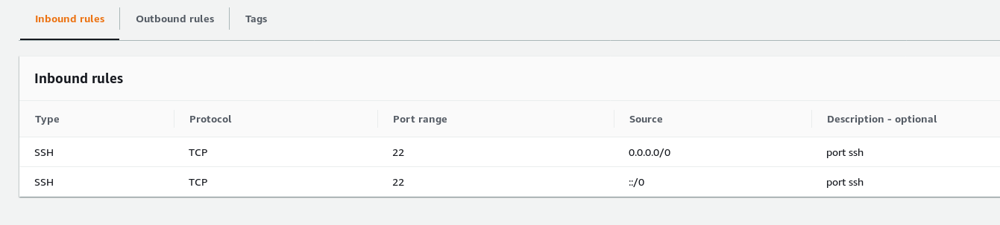
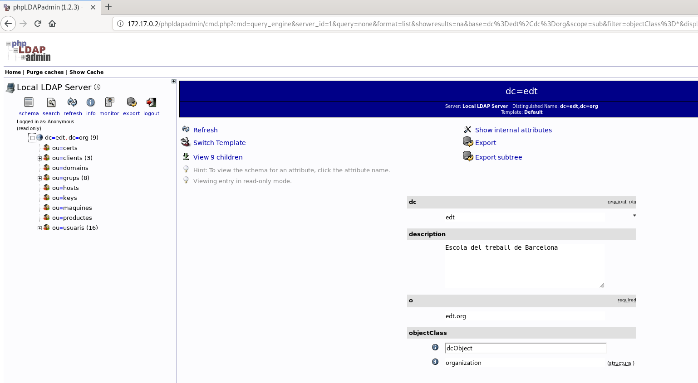

# Exercicis ldap phpldapadmin tunel ssh

# Exercici 1

Comencem per configurar la maquina de Amazon per tal que només es pugui accedir a traves del port 22.



Un cop configurats els ports entrem dins la maquina.


```
[sergi@localhost ~]$ ssh -i .ssh/mykey.pem fedora@3.8.131.199
```

Obrim el container de ldap y comprobem que funciona

```
docker run --rm --name ldap -h ldap -d edtasixm06/ldapserver19


[fedora@ip-172-31-27-185 ~]$ ldapsearch -x -h 172.17.0.2 -b "dc=edt,dc=org"

```

Anem al /etc/hosts i afegim el servidor ldap

Un cop tenim configurat el ldap a amazon, anem al ordinador local i creem un tunel ssh directe a al servidor ldap de Amazon.

```
[sergi@localhost ~]$ ssh -i .ssh/mykey.pem -L 1234:ldap:389 fedora@3.8.131.199

```

Un cop creat el tunel desde l'ordinador local, creem el docker amb el phpldapadmin de forma interactiva ja que haurem de modificar la configuracio

```
[sergi@localhost ~]$ sudo docker run --name php -h php -it edtasixm06/phpldapadmin /bin/bash
```
Dins del docker creem un tunel ssh cap al nostre ordinador local per a permetre la conexio al localhost:1234 del nostre ordinador i aixi poder accedir al ldap.

```
[root@php /]# ssh -L 4321:localhost:1234 sergi@192.168.1.202
```

Al ja tenir acces al ldap anem a configurar el php.

En el fitxer: /etc/phpldapadmin/config.php

configurar el servidor com la nostre ip localhost, 127.0.0.1

i el port possar el que hem assignat en el tunnel ssh.

un cop realitzat aixo encenem el httpd

```
/usr/sbin/httpd
```

I ens conectem desde un navegador a la ip del nostre docker:

172.17.0.2/phpldapadmin



I ja tindriem acces desde el nostre ordinador local a un php que obte la informació de un ldap creat a Amazon i tot de forma segura només accedint per el port 22.

##################################################

Exercici 2
