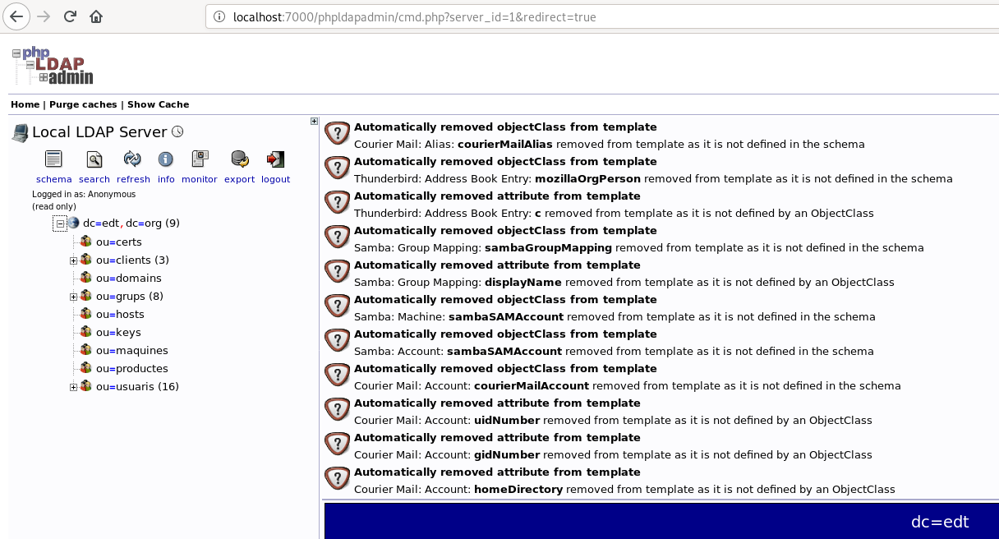

# **Exercicis ldap phpldapadmin tunel ssh**


## Exercici 1

Comencem per configurar la maquina de Amazon per tal que només es pugui
accedir a traves del port 22.


Un cop configurats els ports entrem dins la maquina.


```
[sergi@localhost ~]$ ssh -i .ssh/mykey.pem fedora@3.8.131.199
```

Obrim el container de ldap y comprobem que funciona

```
docker run --rm --name ldap -h ldap -d edtasixm06/ldapserver19


[fedora@ip-172-31-27-185 ~]$ ldapsearch -x -h 172.17.0.2 -b "dc=edt,dc=org"

```

Anem al /etc/hosts i afegim el servidor ldap

Un cop tenim configurat el ldap a amazon, anem al ordinador local i creem
un tunel ssh directe a al servidor ldap de Amazon y comrobem que funciona.

```
[sergi@localhost ~]$ ssh -i .ssh/mykey.pem -L 0.0.0.0:1234:ldap:389 fedora@3.8.131.199

[sergi@localhost ~]$ ldapsearch -x -h 192.168.1.202:1234 -b "dc=edt,dc=org"

```

Un cop creat el tunel desde l'ordinador local, creem el docker amb el
phpldapadmin de forma interactiva ja que haurem de modificar la configuracio

```
[sergi@localhost ~]$ sudo docker run --name php -h php -it edtasixm06/phpldapadmin /bin/bash
```

Al ja tenir acces al ldap anem a configurar el php.

En el fitxer: /etc/phpldapadmin/config.php

configurar el servidor com la nostre ip del ordinador local: 192.168.1.202

i el port possar el que hem assignat en el tunnel ssh es ha dir: 1234.

un cop realitzat aixo configurem i encenem el httpd

```
/usr/sbin/httpd
```

I ens conectem desde un navegador a la ip del nostre docker:

172.17.0.2/phpldapadmin


I ja tindriem acces desde el nostre ordinador local a un php que obte la
informació de un ldap creat a Amazon i tot de forma segura només accedint
per el port 22.

################################################################################

## Exercici 2

Engem un ldap en el nostre ordinador i comprovem que funciona

```
[sergi@localhost ~]$ sudo docker run --rm --name ldap -h ldap -d edtasixm06/ldapserver19

[sergi@localhost ~]$ ldapsearch -x -h 172.17.0.2 -b "dc=edt,dc=org"
```

Configurem el /etc/hosts el servidor ldapsearch

Creem un tunnel ssh invers cap a la maquina de amazon

Pero abans, anirem al fitxer /etc/ssh/sshd_config i en la opcio GatewayPorts
posarem yes

Per a aixi no només tenir acces al ldap desde la interficie de localhost

```
[sergi@localhost ~]$ ssh -i .ssh/mykey.pem -R 0.0.0.0:5000:ldap:389 fedora@3.8.131.199
```

Comprobem que desde Amazon tenim conexio amb el ldap

Probem que funciona el ldap amb la nostre ip

```
[fedora@ip-172-31-27-185 ~]$ ldapsearch -x -LLL -h 172.31.27.185:5000 -b "dc=edt,dc=org"
```

Un cop tenim acces al ldap desde Amazon, obrim un container amb el php.

```
[fedora@ip-172-31-27-185 ~]$ docker run --rm --name php -h php -it edtasixm06/phpldapadmin /bin/bash
```
 I configurem el fitxer /etc/phpldapadmin/config.php

On haurem de asignar la ip del servidor, la ip privada de la nostre maquina
Amazon i el port 5000 ja que es el que hem assignat

Configurem el fitxer del httpd afegin el ServerName i encegem el httpd

```
[root@php /]# /usr/sbin/httpd
```

Un cop configurat el php, anem a la maquina local i creem un tunnel ssh directe
per poder accedir al php.

```
[sergi@localhost ~]$ ssh -i .ssh/mykey.pem -L 0.0.0.0:7000:172.17.0.2:80 fedora@3.8.131.199
```

Un cop creat aquest tunnel anem al navegador del nostre host i probem:

http://localhost:7000/phpldapadmin/

Y podem observar com podem accedir al phpldapadmin.


